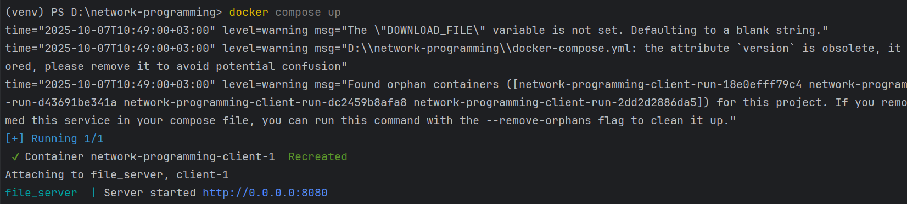
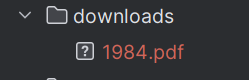
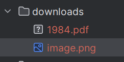

# Laboratory Work 1: HTTP File Server with Docker and TCP Sockets

This lab shows how to create a simple **HTTP file server** and a **client** using Python.  
The project is run inside Docker containers using **Docker Compose**.

---

## How it works

- The **server** shares files from a folder.  
  We can open a web page in the browser (http://localhost:8080) to see and download files.  

- The **client** connects to the server, requests one file, downloads it, saves it, and then stops.  

Both containers run in the same Docker network, so the client can connect to the server using the service name `server`.

---

## 1) Contents of the source directory

Here we show the project files (server, client, Dockerfiles, docker-compose).  


---

## 2) The Docker configuration

### Docker Compose file


### Dockerfiles

- **Dockerfile.server** → runs `Lab1.py`


- **Dockerfile.client** → runs `client.py`


---
# 3) Building and starting the containers
We build the images with:

```bash
docker compose build
````

We start the containers with:

````bash
docker compose up
````



---
# 4) Command that runs the server

When the server container starts, Docker executes:

````
python -u Lab1.py /data
````

- **/data** is the directory argument passed to the server.
- It comes from the environment variable **SERVE_DIR**, which in docker-compose.yml is mapped to the local ./books folder.


---

# 5) Contents of the served directory

The server shares the contents of the books folder.
It is mounted into the container as **/data** (read-only).


---
# 6) Requests to the server in the browser

We test different file requests in the browser.

- Inexistent file → 404 error


- HTML file with image


- PDF file


- PNG image


---

# 7) Running the client

The client is run with:

````bash
pyth on client.py server 8080 <DOWNLOAD_FILE> /downloads
````

In **Docker Compose**, this is configured as:\
```command: [ "server", "8080", "${DOWNLOAD_FILE}", "/downloads" ]```

**Example (PowerShell on Windows):**

````bash
$env:DOWNLOAD_FILE="science_fiction/1984_cover.png"
docker compose up client
````




---

# 8) Directory listing in the browser

The server also supports directory listing.\
When visiting a folder path, the server generates an HTML page with its contents.

**Example**: visiting /browse/fantasy shows the files in the fantasy subdirectory.


---
# 9) Browsing a friend's server

For this part of the lab, I connected to a friend’s server instead of my own.

### Network setup
Both my computer and my friend’s computer were on the same local network.  
To find the friend’s IP address, we used:

- On Windows: `ipconfig` → the IPv4 Address  


Using the browser, I connected to my friend’s server and could see their directory. 


I also tested downloading files from my friend’s server using **my own client implementation**.  

Example command:  

```bash
python client.py 172.20.10.14 8080 shrek/image.png downloads
```


