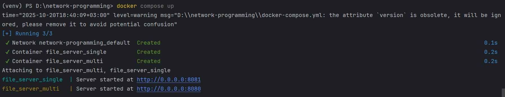
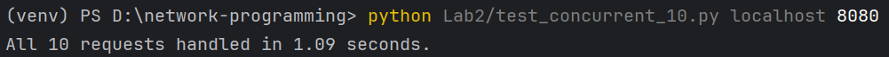
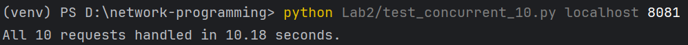
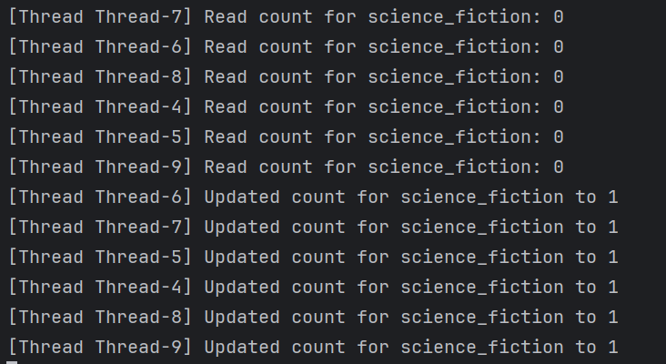
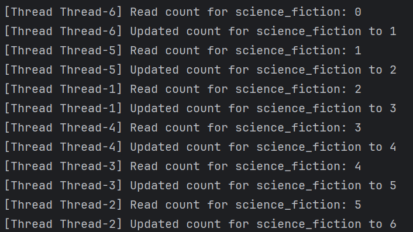
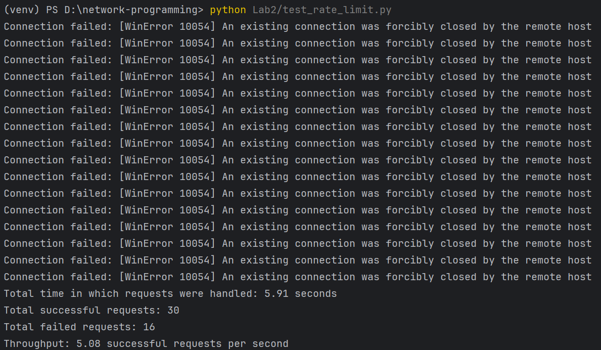
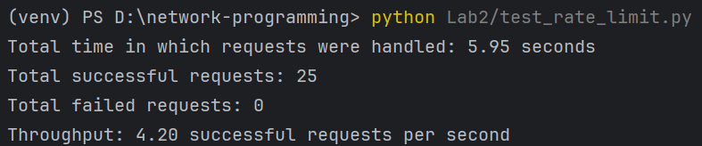
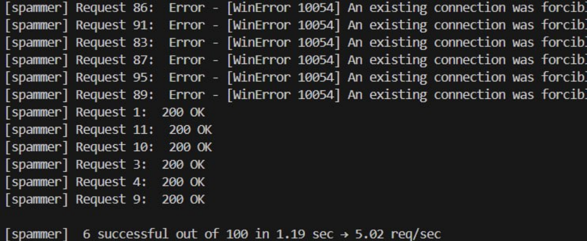
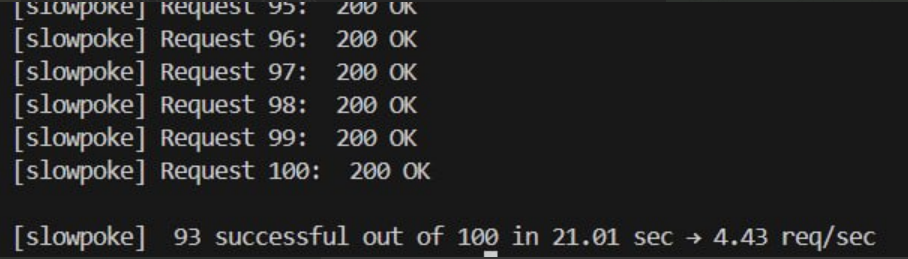

# Laboratory Work 2: Concurrent HTTP Server

----

In this lab, I implemented a multithreaded HTTP server that can handle multiple client connections at the same time. The server uses Python’s threading module to create a new thread for each client request, allowing concurrent handling of multiple connections. I also implemented two additional features: a request counter with synchronization to prevent race conditions, and a rate limiting mechanism that restricts clients to about five requests per second in a thread-safe way.

\
I built the Docker image that contains the multithreaded server code and defined a service for it in the docker-compose.yml file. Then, I started the container using the command:
```docker compose up```\
When the container started, the terminal logs showed that the server was running successfully and listening at http://0.0.0.0:8080. This confirmed that the image was built correctly and that the server was active inside the container.




\
Next, I demonstrated that the server can handle multiple concurrent requests. For this test, I used my Python testing script test_concurrent_10.py, which sends ten requests at the same time to the server. I included a delay of one second in the request handler to simulate real work being done. When I ran this script, it printed the total time taken to complete all ten requests.




\
I compared this result with the single-threaded version of the server from the previous lab. The single-threaded server handled the same ten requests sequentially, taking approximately ten seconds because each request waited for the previous one to finish. In contrast, the multithreaded server handled all ten requests in about one second.




\
Then, I implemented the counter feature, which tracks how many times each file or directory has been requested. When I accessed the server in a web browser, it displayed a table listing files and their hit counts. To demonstrate the race condition, I first removed the synchronization lock from the counter and introduced a small delay in the counting logic, then I used my Python testing script test_concurrent_10.py to send ten requests at the same time to the server. When multiple threads accessed the same file at the same time, the printed output in the terminal showed inconsistent updates in the counter values.




\
After that, I added a count_lock using Python’s threading.Lock() to make the counter updates thread-safe. With the lock in place, each thread waited for the previous one to finish updating the counter before continuing. This eliminated the race condition, and the counter values increased correctly even under concurrent access.




\
Finally, I implemented rate limiting per client IP address. The server keeps track of timestamps for each client’s recent requests and allows only about five requests per second. If a client exceeds this limit, the server responds with “429 Too Many Requests.” To test this, I used my second script that continuously sends requests to the server. When the delay between requests was set to 0.1 seconds, simulating a spammer, many requests were denied with status 429. When the delay was set to 0.25 seconds, representing a normal user, nearly all requests were accepted.





\
In addition to my own tests, my friend connected to my server and performed the same two tests: first by spamming the server with requests at a very high rate, and then by lowering the request rate to stay just under the limit. The results were consistent with mine: when the request rate was high, many responses were rejected with code 429, and when the request rate was lower, nearly all requests succeeded. This confirmed that the rate limiting mechanism works correctly across different clients.





\
From these results, I concluded that the multithreaded HTTP server correctly handles multiple requests in parallel, resolves race conditions in shared data using synchronization, and enforces rate limiting in a thread-safe way. The timing tests clearly show the improvement in performance with threading, and the counter and rate-limiting features work as expected after adding the necessary locks.