# Game Rule Demonstrations

**Rule 1-A**

This screenshot shows trying to flip a card that no longer exists on the board. The flip fails immediately and no control is gained. The game continues normally afterward.

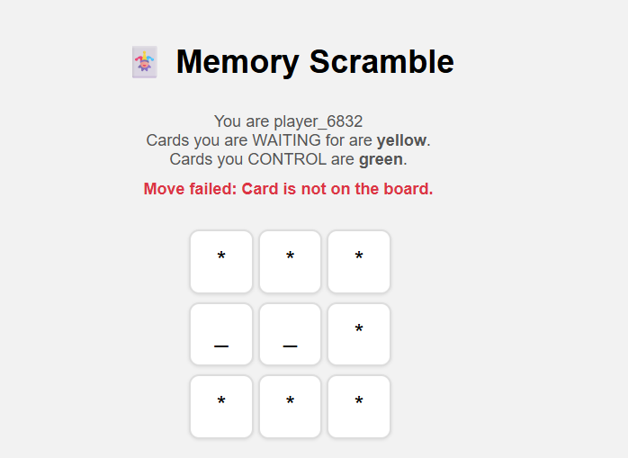

**Rule 1-B**

Here the player flips a face-down card. The card becomes face-up and the player gains control of it. The board updates so all players can see it.

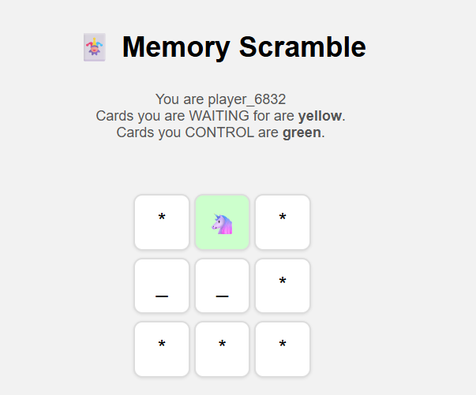

**Rule 1-C**

This screenshot shows flipping a card that is already face-up and uncontrolled. The player simply takes control of it. The board does not change visually because the card was already visible.

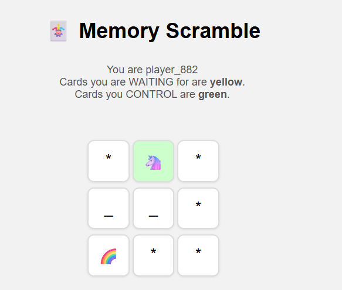

**Rule 1-D**

This screenshot shows a player trying to flip a face-up card that is controlled by someone else. The player is placed in a queue and must wait until the card becomes available. The game does not block other players.

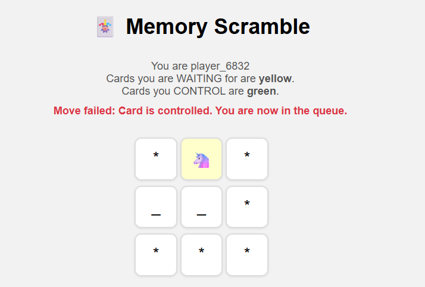

**Rule 2-A**

Here the player tries to flip a second card, but it is gone. The action fails and the player loses control of the first card, although it stays face-up. The player’s turn ends.

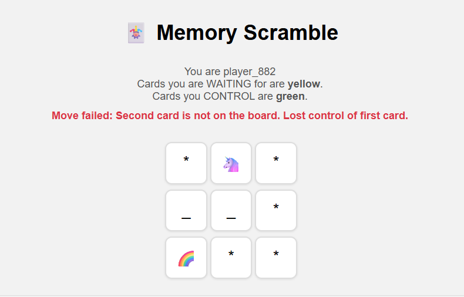

**Rule 2-B**

This screenshot shows trying to flip a second card that is controlled. The operation fails right away, and the player loses control of the first card. The game continues normally.

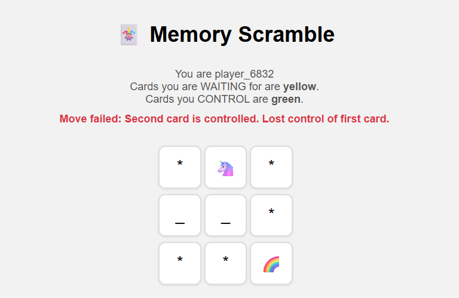

**Rule 2-C**

This shows flipping a second card that was face-down. It gets turned face-up and the player takes control. The turn continues as expected.

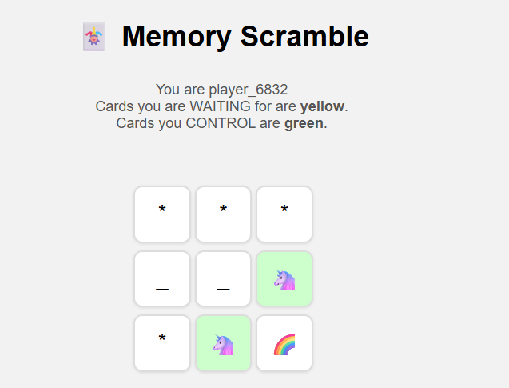

**Rule 2-D**

This screenshot demonstrates a match. The player flips two equal cards, keeps control, and both cards stay face-up. They will be removed on the player’s next turn.

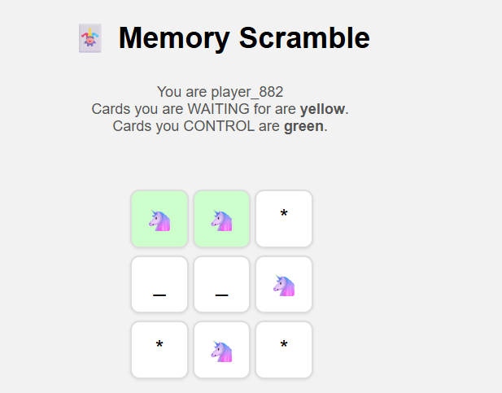

**Rule 2-E**

This shows a mismatch. The player loses control of both cards, but the cards remain face-up on the board. The player will try a new first card next turn.

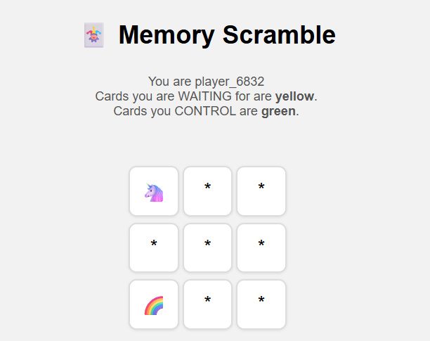

**Rule 3-A**

These screenshots demonstrate cleanup after a match. When the player starts a new turn, previously matched cards are removed from the board and are no longer visible. Control is cleared.

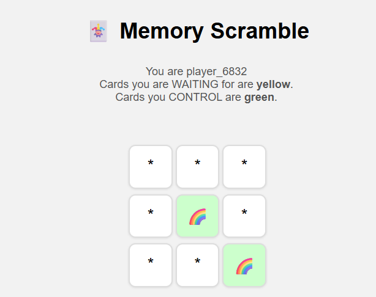
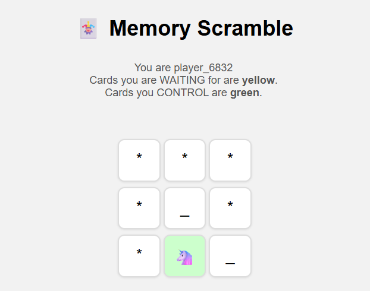

**Rule 3-B**

These screenshots show cleanup after a mismatch. When the player starts a new turn, previously mismatched cards that are still face-up get turned face-down again. Control stays empty.

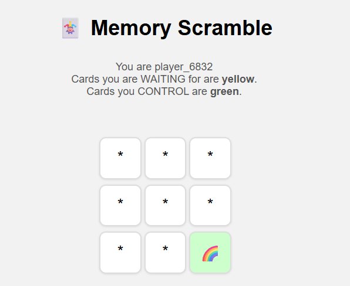

# Map Feature

This screenshot shows replacing all cards with a particular value by a new value. The card values change but card state (face-up/down, control) stays the same. The change appears immediately to all players.

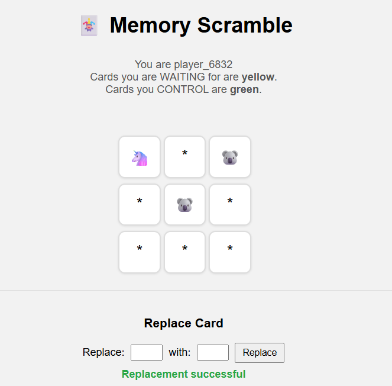

# Reset Feature

This screenshot demonstrates resetting the board. All cards become face-down, unmatched, and uncontrolled, and all player and queue information is cleared. The board returns to its initial state.

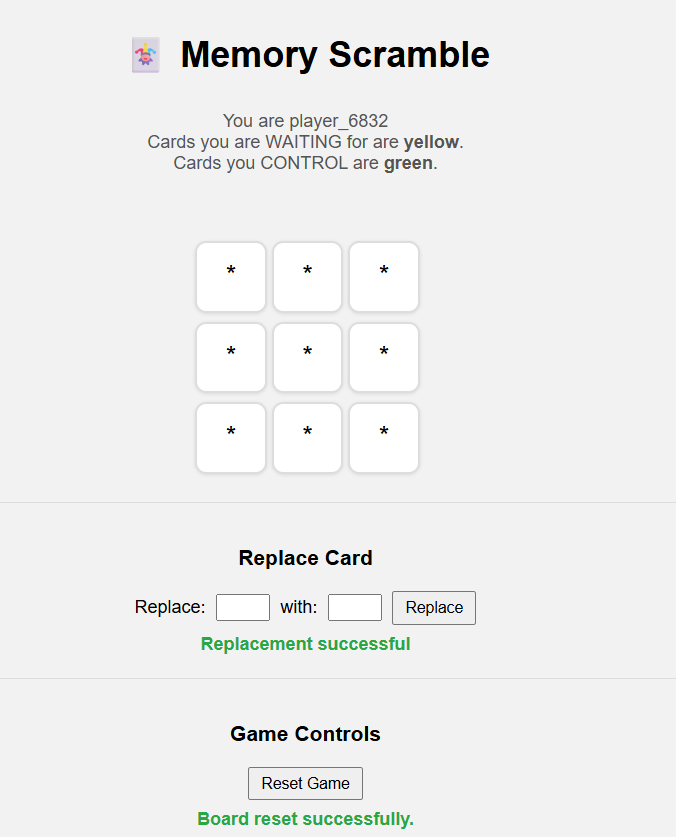

# Board ADT Tests

These tests verify that the Board and Card ADTs behave correctly.
They check that cards respect representation invariants, the board is correctly structured, and parsing from a file builds a valid board.
They also ensure string formatting works and that copying board data does not break rep safety.

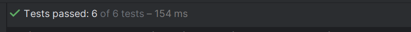

# Concurrency Tests

These tests validate how multiple players interact with the board at the same time.
They confirm that players are queued when trying to flip controlled cards, and that control is passed in FIFO order after mismatches.
They ensure concurrency never breaks internal representation or causes inconsistent state.

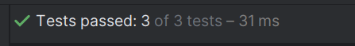

# Game Rule Tests

These tests cover all rules from 1-A to 3-B.
They check correct behavior when flipping first/second cards, matching, mismatching, and automatic cleanup on the next turn.
They ensure that card visibility, control, and removal follow the exact rules of the game.

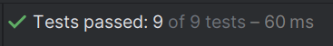

# Map + Watch Tests

These tests verify the extended features.
map/replace tests ensure that card values can be changed safely without breaking the board, and that invalid replacements are rejected.
watch tests confirm that waiting for board changes works correctly and unblocks only when visible card changes occur.

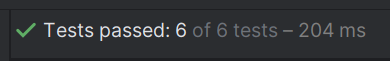

# Simulation result
In the simulation, all 4 players make 100 moves on the board concurrently. The server didn't crash.

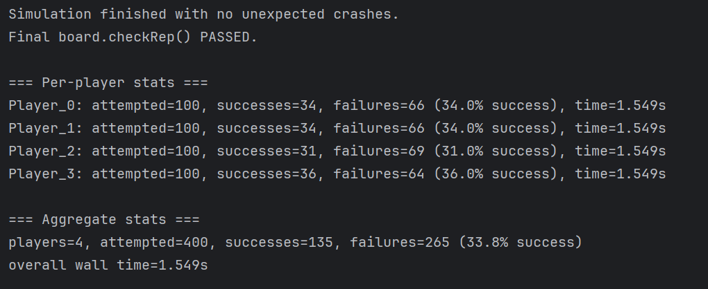